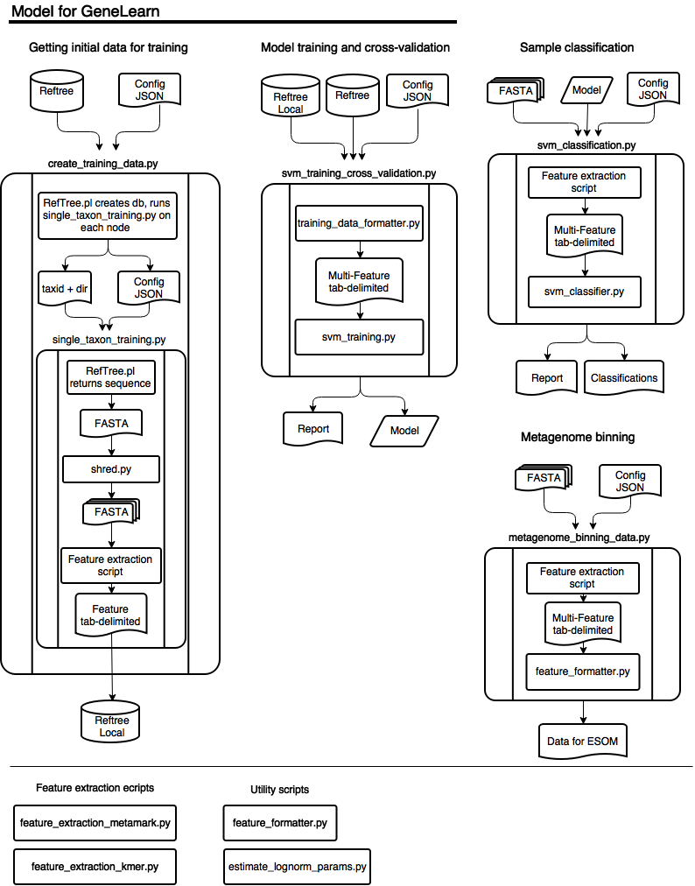

#GeneLearn
## A program to classify, bin and discover divergent  genomic sequences with machine learning using novel feature extraction methods  
 
##Use cases:
* Classifying metagenomic and metatransciptomic contigs taxonomically
* Creating data files for genome binning using emergent self organizing maps (ESOM)
* Identifying metagenomic contigs and metatransciptomic contigs that come from deeply 
  divergent forms of life

# Dependencies
* [GenemarkS version 4.29](http://exon.gatech.edu/GeneMark/)
* [RefTree](https://bitbucket.org/berkeleylab/jgi_reftree)
* [Task Farmer](http://jgi.goe.gov)
* [Python v2.74](https://www.python.org/)
* [Scikit-learn](https://scikits.appspot.com/scikit-learn)
* [Biopython](http://biopython.org)
* [simplejson](https://github.com/simplejson/simplejson)
* [numpy](http://www.numpy.org/)
* [scipy](http://www.scipy.org/)
* [matplotlib](http://matplotlib.org/)
* [khmer v1.4](https://pypi.python.org/pypi/khmer/1.4/)

## Files
###Setup
 * gm_parameters A directory with modified GeneMark Parameter files
 * config.json, training.json - config files for running the classifier 
 * Before running the job:
    1. modify config.json with current environment variables and parameters 
    2. run script/setup_configuration.py to create necessary scripts (env.sh and single_taxon_training.sh)
 
### Creating Training data
 * crate_training_data.py - a wrapper to have reftree run single_taxon_training.py on each taxon below the selected taxonomic node
 * single_taxon_training.sh - a shell script that calls single_taxon_training.py
 * single_taxon_training.py - A wrapper to have run tasks necessary to create training data for a single genome
 	1. shred.py - shreds the genome into smaller pieces of fixed length or sizes conforming to a gamma distribution
 	2. Feature extraction script - see below of a list of features

###model training and cross validation via SVM
* svm_training_cross_validation.py
	1. training_data_formatter.py - a script to take taxonomic nodes or levels and create
	 a multi feature JSON file for classification 
	2. svm_training.py - A script to take training data, do a parameter search, create a model and cross-validate it 

### Sample classification
* svm_classification.py - a wrapper to run SVM classification
	1. feature extraction scripts - see below
	2. feature_formatter.py - a utility script  to format csv feature data into json data
	3. svm_classifier.py a script to load a SVM model and classify sequences

### Producing data for genome binning
* metagenome_binning_data.py -a a wrapper for producing genome binning data
	1. Feature extraction script
	2. feature formatter
	

### Feature extraction ecripts 
* feature_extraction_metamark.py - a wrapper to run metamark and extract the genomic feature
* feature_extraction_kmer.py an alternate method of extracting feature information by kmer

### Utility scripts 
* feature_formatter.py - a script to convert between tab delimited and ESOM data formats
* estimate_gamma_parameters.py - a script to estimate gamma parameters from a dataset that will be classified

## Diagram of program

