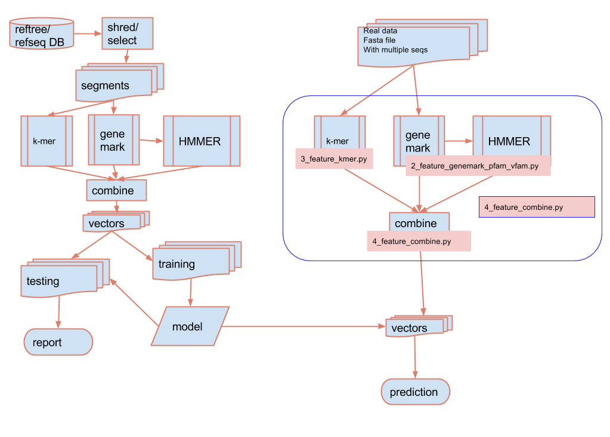

#ViCA
##   Classifying virus from metagenomic and metatransciptomic contigs
 


# Dependencies
* [GenemarkS version 4.29](http://exon.gatech.edu/GeneMark/)
* [RefTree](https://bitbucket.org/berkeleylab/jgi_reftree)
* [Task Farmer](http://jgi.goe.gov)
* [Python v2.74](https://www.python.org/)
* [Scikit-learn](https://scikits.appspot.com/scikit-learn)
* [Biopython](http://biopython.org)
* [simplejson](https://github.com/simplejson/simplejson)
* [numpy](http://www.numpy.org/)
* [scipy](http://www.scipy.org/)
* [matplotlib](http://matplotlib.org/)
* [khmer v1.4](https://pypi.python.org/pypi/khmer/1.4/)
* Pfam/Vfam HMMER

# User Case

With this package, a model is offered with training using simulated data from
RefSeq genomes. Tools are provided if the users want to train the model 
themselves with their own data. 


## Model Tuning
split into training and testing
```angular2html
scripts/5_create_training_testing_with_seq_name.py
```
model training
```angular2html
spark-submit ./scripts/spark_training_model.py training.vect training.vect_model
```

model evaluation
```
spark-submit ./scripts/spark_evaluating_model.py testing.vect training.vect_model/ testing.vect.prediction testing.vect.report testing.vect.prc.png
```


## Training

model training (small data set)
```angular2html
spark-submit ./scripts/spark_training_model.py training.vect training.vect_model
```

## Prediction
There are three use cases for doing the prediction:

- Large scale prediction - pipeline (in NextFlow) used for prediction on large 
number of sequences using HPC or Cloud system

a. feature extraction using nextflow workflow management
```angular2html
scripts/feature_extraction.nf
```
b. using spark to do prediction on the vectors
```angular2html
scripts/spark_prediction.py
```

- Small scale prediction  - downloadable package used for prediction on small
number of sequences running locally (like a laptop)
```angular2html
~/scripts/prediction_pipeline_lite.py
usage: prediction_pipeline_lite.py [-h]
                                   input_file output_file genemark_path
                                   hmmer_path hmmer_db spark_path feature_file
                                   model_directory

```


- Web Application - a web interface where the users can submit small number of
sequences for prediction
```angular2html
~/web/server.py
```

## Diagram of program




